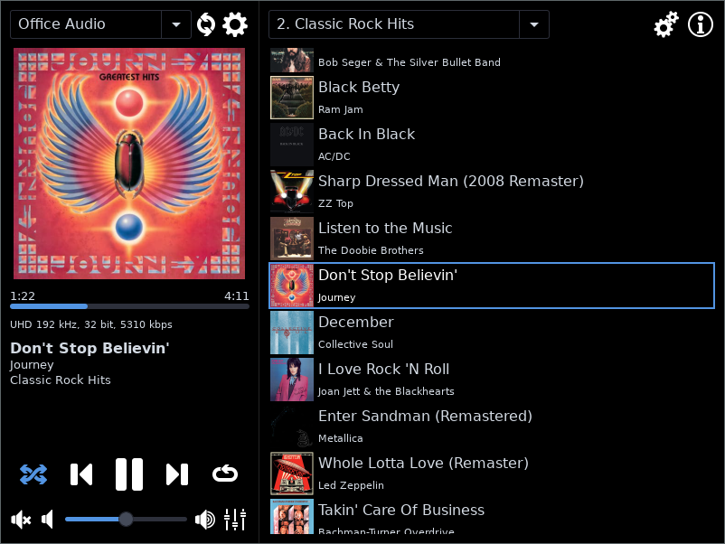

# WiiM Play - UPNP Control Point for WiiM Music Streamers

WiiM Play is a UPNP control point designed to manage the [WiiM music streamer products](https://www.wiimhome.com/) from Linkplay Technology Inc. Linkplay produces the WiiM Home app for controlling their devices but unfortunately it is not available for Linux. I created WiiM Play to enable me to view and control the music playback from these devices under Linux.

## Features

* Automatic discovery of WiiM devices on network
* Graphical user interface - view and control all aspects of playback
* Desktop notifications - displays album art and track metadata in most Linux desktop environments
* Status tray icon - provides track metadata on hover and mouse controls
* MPRIS support - allows using WiiM Play with other MPRIS-enabled software

## User Interface

* GTK3-based
* Player transport controls (play/pause, forward, backward, loop, shuffle)
* Album art download
* Seek/time bar
* Stream quality display
* Volume/mute control
* Equalizer selection
* Track metadata (title, artist, album)
* Current play queue with album art thumbnails
* Select presets created in the WiiM Home app
* Switch between multiple WiiM devices
* Player settings (audio output port, balance, fade effects, fixed volume, etc.)

By default, the window is hidden when closed. There is a configuration setting to disable this and quit the application instead.

## Notifications

WiiM Play uses GTK to show notifications including the album art and track metadata. How these notifications are displayed depends on your Linux desktop environment. Here is an example using the [dunst notification daemon](https://dunst-project.org/):

This feature may be disabled in the settings.

## Status Icon

WiiM Play uses GTK to show the status icon.  Under X11, GTK uses the [freedektop.org systemtray-spec](https://www.freedesktop.org/wiki/Specifications/systemtray-spec/). You can disable the status icon in the settings.

The status icon supports the following mouse actions:

* Hover to show the track metadata
* Left click to show or hide the user interface window
* Middle click to toggle play/pause
* Right click to display a player control menu
* Forward click to go to next track
* Backward click to go to previous track

## MPRIS

WiiM Play supports MPRIS player controls and events. This allows using WiiM Play in tandem with other Linux software like [playerctl](https://github.com/altdesktop/playerctl), [mpris-ctl](https://git.sr.ht/~mariusor/mpris-ctl), [osdlyrics](https://github.com/osdlyrics/osdlyrics), etc.

A common use case for MPRIS player controls is supporting media keys on keyboards.  For example, with the i3 window manager I bind my keyboard media keys with the following config:

    bindsym XF86AudioPlay exec playerctl play-pause
    bindsym XF86AudioNext exec playerctl next
    bindsym XF86AudioPrev exec playerctl previous
    bindsym Control+XF86AudioRaiseVolume exec playerctl volume 0.05+
    bindsym Control+XF86AudioLowerVolume exec playerctl volume 0.05-
    bindsym Control+XF86AudioMute exec playerctl volume 0.0

It is likely you can do something similar in your own Linux desktop environment.

MPRIS player events are broadcasts to notify the system of a change in player state or metadata. You can use these events to show notifications, display on-screen lyrics, or trigger other actions.

This feature may be disabled in the settings.

## Installation

Download a release and copy the wiimplay executable to a location on your path. You will need GTK3 and its associated libraries installed.

## Build

From the top level directory, either run make to create a stipped and compressed binary:

    $ make

Or use the go utility to create an uncompressed binary:

    $ go build -tags=gtk_3_10 .

## TODO

### Browsing

I decided against supporting any type of music browsing or playlist creation in WiiM Play for now due to the effort required. You must create playlists using the WiiM Home app and save them as presets in order for WiiM Play to select them.

### Groups

I only own a single WiiM Pro device so this is not something very high on my priority list. I'm open to contributions though.

### Porting

The focus of WiiM Play is to run on Linux. GTK does run under Windows, MacOS, and other Unixes so it may be possible to port WiiM Play to these environments though other features like the status icon and MPRIS would need removing or porting per platform.

### Themes

Not everyone might like the black aesthetic so I might add a way to change the theme colors.
